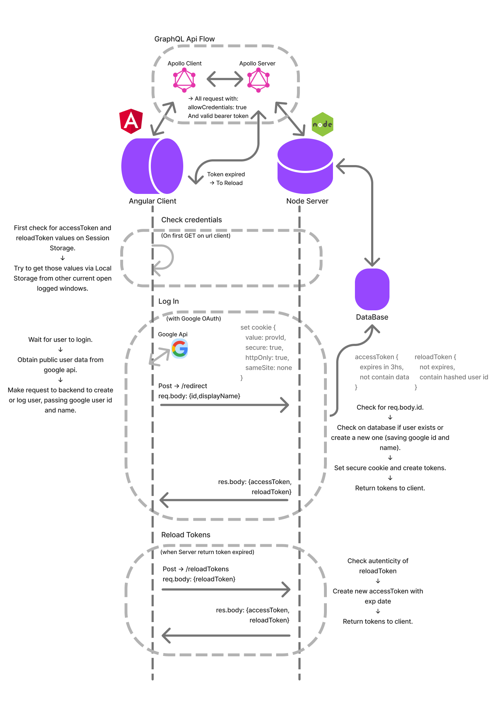

# To-Do App v.4

---

###### CLIENT/SERVER Arq - Login - Database - Apollo - Schema-first approach

[Live Angular Client](https://eov-todo-client.herokuapp.com/) - [Live Node Server](https://eov-todo-api.herokuapp.com/) - [Get a Mongo Free Cluster ](https://cloud.mongodb.com/)

##### _NestJs - GraphQl - Mongoose - Jwt - Angular - OAuth_

---

This is a **typical to-do application** created to show how to implement **secure authentication** in a **client-server** architecture.

In order to do so:

- Implemented client side authentication with the Google OAuth 2.0 API
- Google ID is sent to the server
- The server creates/finds a user
- The server returns tokens and enables **secure httpOnly cookie**

Secure **ALL** sensitive endpoints on the server _(only /redirect and /reloadTokens remain public)_ by:

- Requesting for credentials to the client
- Checking existence and validity of the token

on each request.



---

## Installations

##### Server (development environment)

Private keys and static redirects from the server to the client were used, so if you want to recreate this server in a development environment, several things need to be done:

- Create an account at https://cloud.mongodb.com/, then click connect to get your connection URL.
- Replace the URL you get from the mongo database in the app/app.module.ts file
- Go to https://console.cloud.google.com/ and register your project, go to Apis and services > credentials, you need to generate a ClientId and clientSecret, and register your redirect urls in the google clud console.
- Replace your ClientId and clientSecret in app/auth/services/googleStrategy.service.ts file
- Replace the successful and failed redirect URLs with the one your client uses in the app/auth/auth.controler.ts file
- Finally, you need to configure your own jwt secret pass, in these two files: app/auth/services/auth.service.ts and app/auth/services/jwtStrategy.service.ts.
  **In both files the pass must be the same**

So just run:

```sh
cd server
npm me
npm run start: dev
```

##### Client (development environment)

Change the _server_host_ field in environments.prod.ts and environments.ts

```sh
cd client
npm me
ng serve -o
```
